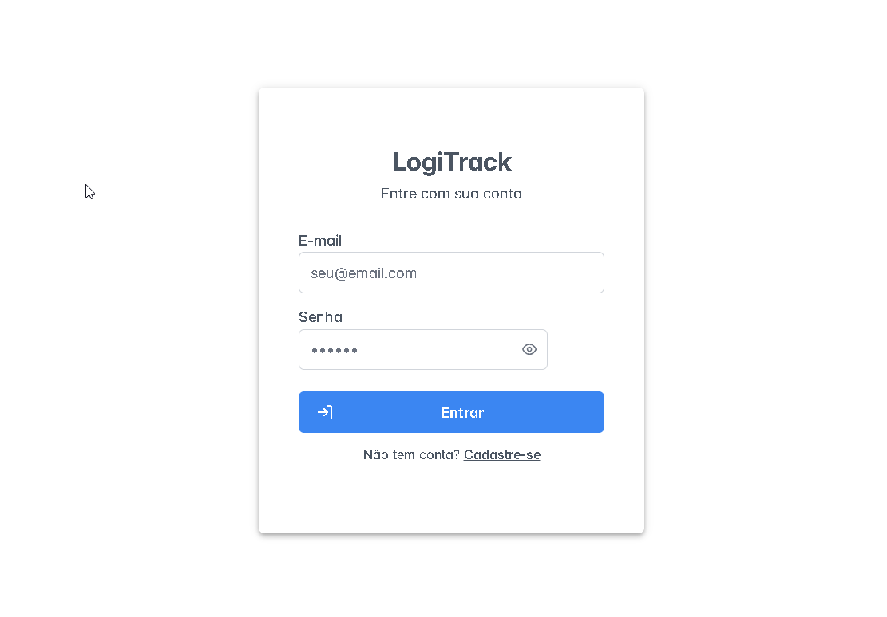
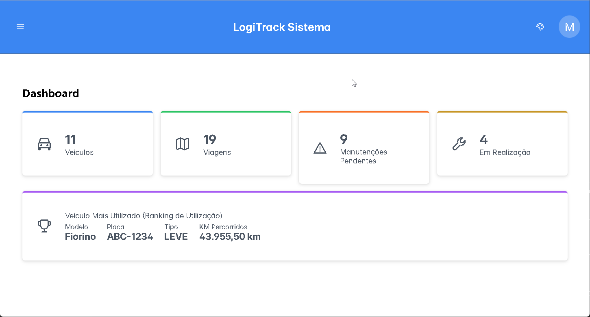
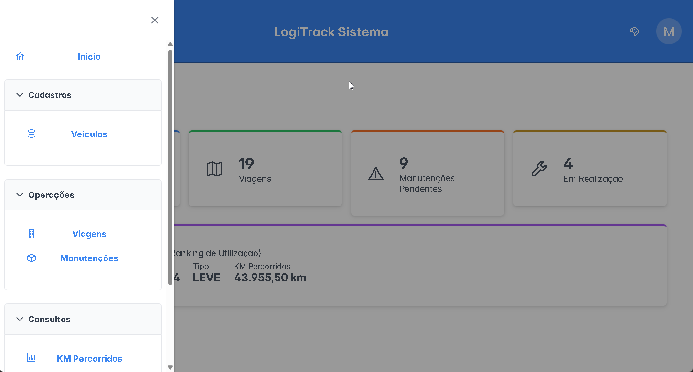
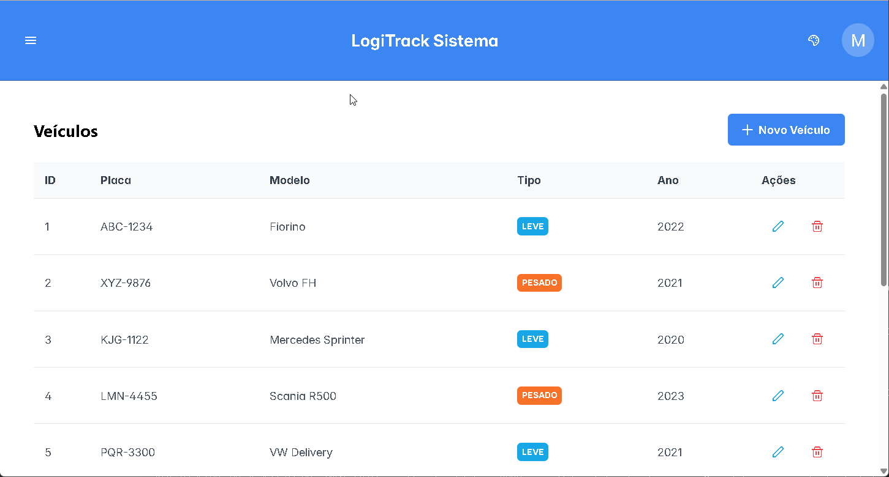
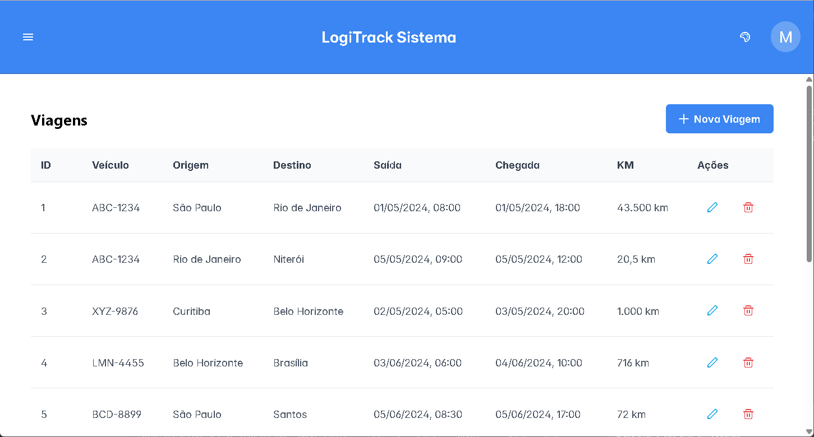
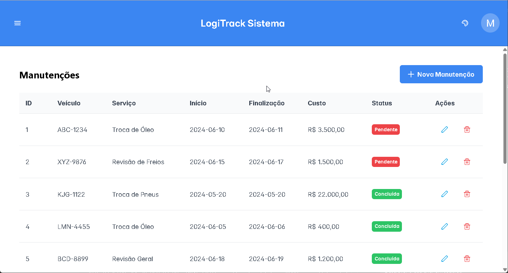
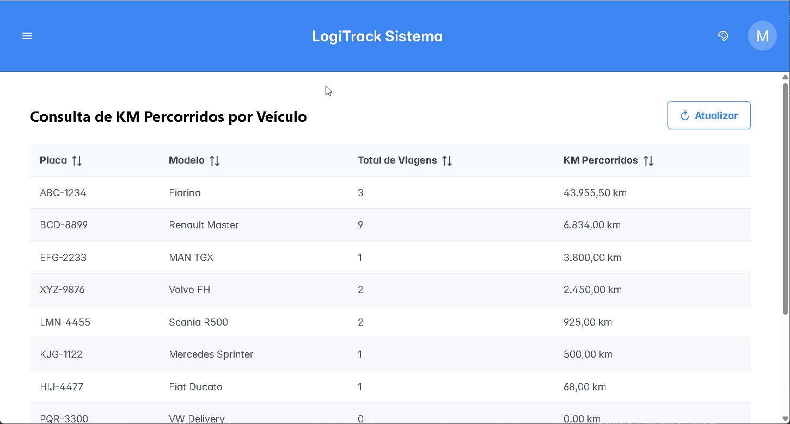
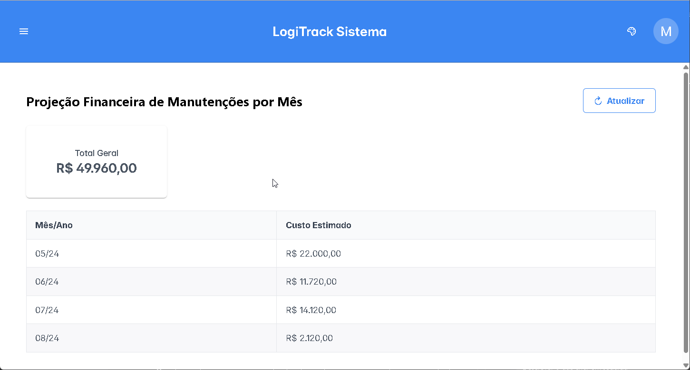
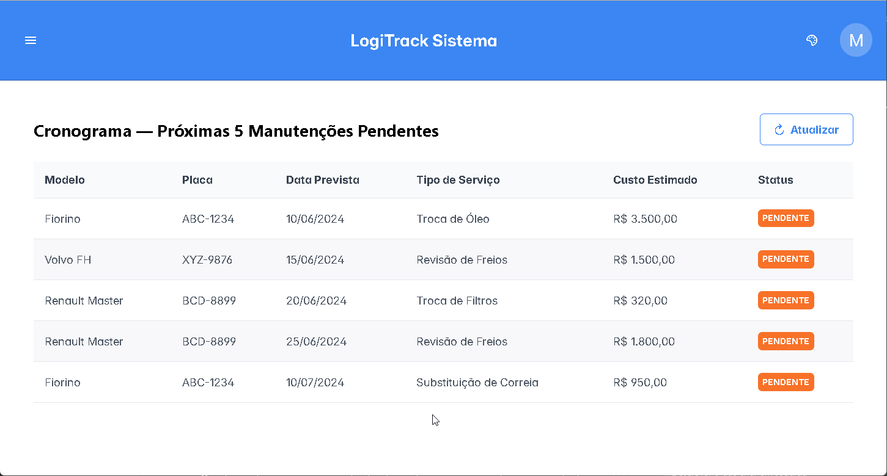
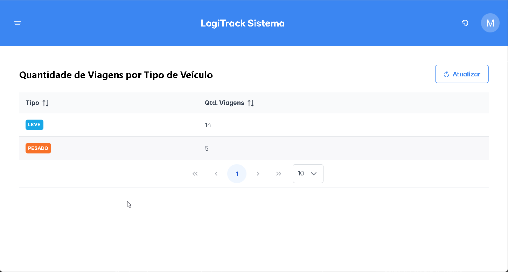

# LogiTrack

Sistema de gestão logística para frotas de veículos. Permite o cadastro e acompanhamento de veículos, controle de viagens realizadas, gerenciamento de manutenções e geração de consultas analíticas como projeção financeira, quilometragem percorrida e próximas manutenções previstas.
Sistema desenvolvido como parte de um desafio técnico para a vaga de Desenvolvedor Full Stack Pleno na empresa LogiTrack.

---

## Sumário

- [LogiTrack](#logitrack)
  - [Sumário](#sumário)
  - [Pré-requisitos](#pré-requisitos)
  - [Como executar](#como-executar)
    - [Backend](#backend)
      - [Variáveis de ambiente (opcionais)](#variáveis-de-ambiente-opcionais)
    - [Frontend](#frontend)
  - [Tecnologias utilizadas](#tecnologias-utilizadas)
    - [Tecnologias — Backend](#tecnologias--backend)
      - [Arquitetura do Backend](#arquitetura-do-backend)
    - [Tecnologias — Frontend](#tecnologias--frontend)
      - [Estrutura do Frontend](#estrutura-do-frontend)

---

## Pré-requisitos

Antes de iniciar, certifique-se de que você possui instalado:

- [Java 21+](https://adoptium.net/)
- [Maven 3.9+](https://maven.apache.org/) (ou use o wrapper `mvnw` incluído no projeto)
- [Node.js 20+](https://nodejs.org/) e npm
- [Docker Desktop](https://www.docker.com/products/docker-desktop/) (para subir o banco de dados MySQL via Docker Compose)

---

## Como executar

### Backend

O backend utiliza **Docker Compose** para subir o banco de dados MySQL automaticamente ao iniciar a aplicação (desde que o Docker Desktop esteja em execução).

1. Acesse a pasta do backend:
   ```bash
   cd backend
   ```

2. Execute o projeto com o Maven Wrapper:
   ```bash
   ./mvnw spring-boot:run
   ```
   > No Windows, use: `mvnw.cmd spring-boot:run`

3. O Spring Boot irá:
   - Subir automaticamente o container MySQL via `compose.yaml`
   - Aplicar as migrations do banco de dados com o **Flyway**
   - Iniciar a API na porta **8080**

4. Acesse a documentação interativa da API (Swagger UI):
   ```
   http://localhost:8080/swagger-ui.html
   ```

#### Variáveis de ambiente (opcionais)

| Variável              | Padrão                                                  | Descrição                        |
| --------------------- | ------------------------------------------------------- | -------------------------------- |
| `MYSQL_USER`          | `logitrack_user`                                        | Usuário do banco de dados        |
| `MYSQL_PASSWORD`      | `logitrack_pass`                                        | Senha do banco de dados          |
| `MYSQL_ROOT_PASSWORD` | `rootpass123`                                           | Senha do root do MySQL           |
| `JWT_SECRET`          | `logitrack-jwt-secret-key-change-in-production-use-env` | Chave secreta do JWT             |
| `JWT_EXPIRATION_MS`   | `86400000`                                              | Tempo de expiração do token (ms) |

> **Atenção:** Em ambiente de produção, substitua os valores padrão sensíveis por variáveis de ambiente reais.

---

### Frontend

1. Acesse a pasta do frontend:
   ```bash
   cd FrontEnd
   ```

2. Instale as dependências:
   ```bash
   npm install
   ```

3. Inicie o servidor de desenvolvimento:
   ```bash
   npm run dev
   ```

4. Acesse a aplicação no navegador:
   ```
   http://localhost:5173
   ```

> Certifique-se de que o backend está em execução antes de usar o frontend.
> 
> Credenciais para acesso:
> - Login: mauro@gmail.com
> - Senha: 123456
---

## Tecnologias utilizadas

### Tecnologias — Backend

| Tecnologia                      | Versão          | Descrição                                       |
| ------------------------------- | --------------- | ----------------------------------------------- |
| **Java**                        | 21              | Linguagem principal da aplicação                |
| **Spring Boot**                 | 3.5.11          | Framework base da aplicação                     |
| **Spring Security**             | (via Boot)      | Autenticação e autorização                      |
| **Spring Data JPA**             | (via Boot)      | Abstração de acesso a dados com Hibernate       |
| **Spring Web**                  | (via Boot)      | Criação de APIs REST                            |
| **Spring Validation**           | (via Boot)      | Validação de dados de entrada (Bean Validation) |
| **Spring Actuator**             | (via Boot)      | Monitoramento e health check da aplicação       |
| **Spring DevTools**             | (via Boot)      | Hot reload em ambiente de desenvolvimento       |
| **Spring Docker Compose**       | (via Boot)      | Integração automática com Docker Compose        |
| **MySQL**                       | latest (Docker) | Banco de dados relacional                       |
| **Flyway**                      | (via Boot)      | Versionamento e migrations do banco de dados    |
| **JWT (JJWT)**                  | 0.12.6          | Geração e validação de tokens JWT               |
| **Lombok**                      | (via Boot)      | Redução de boilerplate com geração de código    |
| **SpringDoc OpenAPI (Swagger)** | 2.8.5           | Documentação automática da API REST             |
| **Docker Compose**              | —               | Orquestração do container MySQL                 |

#### Arquitetura do Backend

O backend segue a arquitetura em camadas:

```
controller/   → Endpoints REST (AuthController, VeiculoController, ViagemController, ManutencaoController)
service/      → Regras de negócio
repository/   → Acesso ao banco de dados (Spring Data JPA)
model/        → Entidades JPA (Veiculo, Viagem, Manutencao, Usuario)
dto/          → Objetos de transferência de dados
mapper/       → Conversão entre entidades e DTOs
sec/          → Configurações de segurança (JWT, Spring Security)
advice/       → Tratamento centralizado de exceções
```

---

### Tecnologias — Frontend

| Tecnologia           | Versão | Descrição                              |
| -------------------- | ------ | -------------------------------------- |
| **React**            | 19     | Biblioteca principal de UI             |
| **TypeScript**       | 5.9    | Tipagem estática para JavaScript       |
| **Vite**             | 8      | Bundler e servidor de desenvolvimento  |
| **React Router DOM** | 7      | Roteamento client-side (SPA)           |
| **PrimeReact**       | 10     | Biblioteca de componentes UI           |
| **PrimeFlex**        | 4      | Utilitários CSS para layout responsivo |
| **PrimeIcons**       | 7      | Biblioteca de ícones                   |

#### Estrutura do Frontend

```
pages/        → Telas da aplicação
  ├── LoginPage             → Autenticação de usuários
  ├── RegisterPage          → Cadastro de novos usuários
  ├── DashboardPage         → Painel principal com resumo do sistema
  ├── VeiculosPage          → Cadastro e listagem de veículos
  ├── ViagensPage           → Registro e listagem de viagens
  ├── ManutencoesPage       → Controle de manutenções
  ├── ConsultaKmPage        → Consulta de quilometragem por veículo
  ├── ConsultaProjecaoFinanceiraPage → Projeção de custos de manutenção
  ├── ConsultaProximasManutencoes    → Previsão de próximas manutenções
  └── ConsultaViagensPorTipoPage     → Análise de viagens por tipo de veículo

components/   → Componentes reutilizáveis (TopBar, Layout, PrivateRoute, ThemeSelector)
contexts/     → Contextos globais (AuthContext, ThemeContext)
hooks/        → Hooks customizados (useAuth, useTheme, useApiErrorNavigation)
utils/        → Funções utilitárias (api.ts para requisições HTTP, auth.ts para token)
types/        → Tipos TypeScript compartilhados
```

*Sobre os comandos SQL (solicitados no desafio)*

●  Total de KM percorrido: Soma da quilometragem de um veículo específico ou de toda a frota.

    SELECT v.placa        AS placa,
                   v.modelo       AS modelo,
                   COUNT(vg.id)   AS totalViagens,
                   COALESCE(SUM(vg.km_percorrida), 0) AS totalKmRodados
            FROM veiculos v
            LEFT JOIN viagens vg ON v.id = vg.veiculo_id
            GROUP BY v.id, v.placa, v.modelo
            ORDER BY totalKmRodados DESC;

●  Volume por Categoria: Quantidade de viagens realizadas filtradas por tipo de veículo (Leve vs 
Pesado). 


    SELECT v.tipo AS tipo,
			COALESCE(COUNT(vj.veiculo_id), 0) AS qtdViagens
				FROM veiculos v
				LEFT JOIN viagens vj ON vj.veiculo_id = v.id
				GROUP BY v.tipo
				ORDER BY v.tipo, qtdViagens DESC;


●  Cronograma de Manutenção: Listagem das próximas 5 manutenções agendadas (ordenadas por 
data). 


    SELECT v.modelo AS modelo,
                   v.placa          AS placa,
                   m.data_inicio    AS dataInicio,
                   m.tipo_servico   AS tipoServico,
                   m.custo_estimado AS custoEstimado
            FROM manutencoes m
            INNER JOIN veiculos v ON v.id = m.veiculo_id
            WHERE m.status = 'PENDENTE'
            ORDER BY m.data_inicio
            LIMIT 5;


●  Ranking de Utilização: Identificar qual veículo possui a maior soma de quilometragem acumulada. 


    SELECT  v.modelo                AS modelo, 
            v.placa                 AS placa, 
            v.tipo                  AS tipo,
            SUM(vg.km_percorrida)   AS kmPercorridos 
            FROM viagens vg 
            INNER JOIN veiculos v ON v.id = vg.veiculo_id 
            GROUP BY vg.veiculo_id 
            ORDER BY kmPercorridos DESC LIMIT 1;
    


●  Projeção Financeira: Soma do custo total estimado em manutenções para o mês atual.


    ```
    SELECT DATE_FORMAT(data_inicio, '%m/%y')        AS mesAno,
                   SUM(custo_estimado)              AS custo
            FROM manutencoes
            GROUP BY mesAno
            ORDER BY MIN(data_inicio);
    ```

*Ajustes realizados para atender aos requisitos do desafio:*

    - inclusão da tabela usuarios para autenticação e controle de acesso
    - inclusão de dados adicionais nas consultas SQL para fornecer informações mais completas (ex: modelo e placa dos veículos)

Obs: Os script sql estão disponíveis na pasta resource do backend, na pasta `db/migrations`.
  
  *Screenshots das telas implementadas no frontend:*

*Tela de Acesso*
  [](./Screenshots/telaacesso.png)

*Tela Principal do Dashboard*
  [](./Screenshots/dashboard.png)

*Menu Principal*  
  [](./Screenshots/menu-principal.png)

*Cadastro de Veículos*
  [](./Screenshots/veiculos.png)

*Registro de Viagens*
  [](./Screenshots/viagens.png)
  
*Controle de Manutenções*
  [](./Screenshots/manutencoes.png)
  
*Consulta de Quilometragem*
  [](./Screenshots/consulta-km.png)

*Projeção Financeira*
  [](./Screenshots/projecao-financeira.png)
  
*Proximas Manutenções*
  [](./Screenshots/proximas-manutencoes.png)
  
*Viagens por Tipo de Veículo*
  [](./Screenshots/viagens-por-tipo.png)
